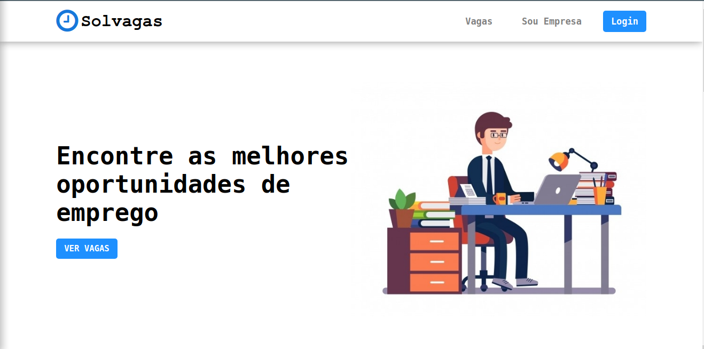

## SOL-VAGAS - é um  site para pesquisa, candidaturas e publicação de vagas de emprego. 

##  Layout do Projecto

 

## Tecnologias e Ferramentas de Desenvolvimento utilizadas:
* PHP 7
* Mysql
* Html, Css
* Plates engine
* Padrão de Desenvolvimento MVC
##

## Requisitos
* PHP >= 7.3
* MySQL
##

## Instruções de instalação:
* Crie um banco de dados em localhost ou online
* Importe o arquivo "job.sql" que está dentro da pasta Database para o banco que você criou.
* Edite o arquivo de configurações "config.php" na pasta "App/Utils" de acordo com o seu ambiente.
##
